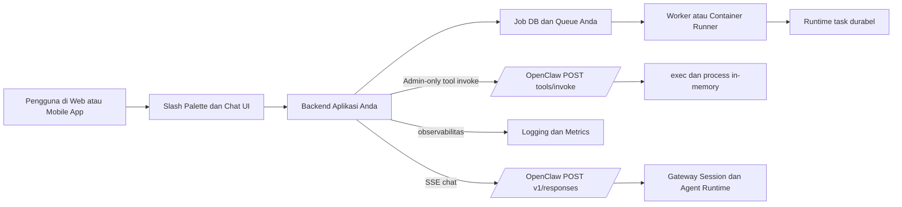
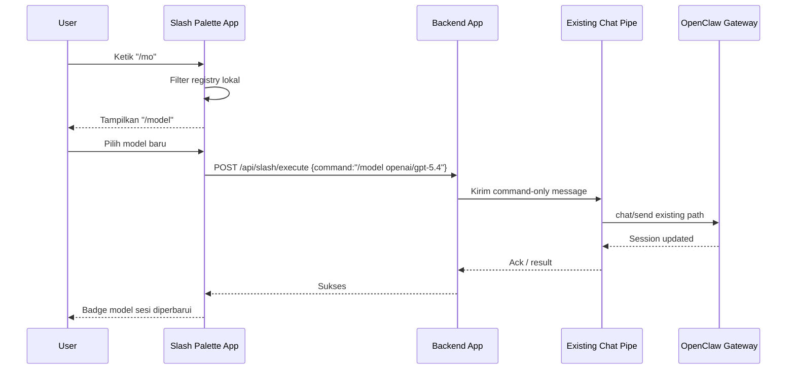
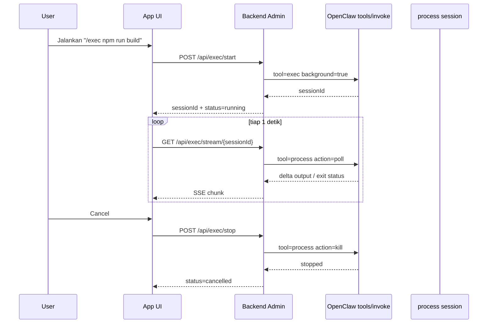

# Laporan Integrasi OpenClaw untuk Slash Commands dan Exec Latar Belakang

## Ringkasan eksekutif

Untuk aplikasi eksternal, jalur integrasi resmi OpenClaw **saat ini** adalah **Gateway WebSocket protocol + RPC**. Dokumentasi OpenClaw secara eksplisit menyarankan klien eksternal—dashboard, app, CI job, IDE extension, dan proses lain—berbicara ke Gateway melalui WebSocket dan RPC untuk memulai run, menerima stream event, menunggu hasil, membatalkan pekerjaan, dan menginspeksi resource. Pada halaman yang sama, dokumentasi juga menyatakan bahwa **belum ada paket npm klien publik** yang boleh dijadikan dependensi resmi, sehingga integrasi Node.js biasanya harus memakai WebSocket/HTTP mentah atau shelling ke CLI. citeturn13view0turn29view0

Untuk kebutuhan Anda yang spesifik, ada dua kesimpulan utama. Pertama, **menu slash-command ala Telegram untuk aplikasi kustom bukan fitur yang otomatis “keluar” dari OpenClaw API**. OpenClaw memang punya sistem slash command, native command registration untuk channel tertentu seperti Telegram/Discord, dan kontrak UI interaktif `MessagePresentation` untuk tombol/select menu. Namun untuk **external app**, Anda tetap perlu membangun **registry command dan UI palette** di aplikasi sendiri, lalu meneruskan command yang dipilih ke jalur chat/routing OpenClaw yang sudah Anda miliki. Jika Anda ingin integrasi yang benar-benar “native” di dalam ekosistem OpenClaw, jalurnya adalah **membangun channel plugin OpenClaw**, bukan sekadar memanggil HTTP endpoint dari app Anda. citeturn22view1turn22view5turn23view0turn27view0

Kedua, alasan paling mungkin mengapa Anda **sudah bisa chat biasa tetapi tidak bisa exec background** adalah karena Anda mencoba memakai permukaan HTTP yang salah atau belum membuka exposure yang memang diblok secara default. Endpoint `POST /tools/invoke` memang bisa memanggil satu tool langsung, tetapi **`exec` diblok oleh hard deny list HTTP secara default** karena merupakan RCE surface. OpenClaw memang mengizinkan override melalui `gateway.tools.allow`, tetapi dokumentasi menekankan bahwa ini adalah **exposure override** yang berbahaya dan tidak boleh dibagikan ke caller tak tepercaya. Selain itu, background process OpenClaw bersifat **in-memory, per-agent, dan hilang saat gateway restart**; ini cocok untuk sesi terminal interaktif atau pekerjaan singkat/menengah, tetapi **bukan** scheduler/queue durabel pengganti worker system Anda sendiri. citeturn28view0turn28view4turn4view6

Rekomendasi implementasi saya adalah arsitektur **hybrid**. Gunakan OpenClaw untuk **chat orchestration**, **slash-command semantics**, **session state**, **model routing**, dan—bila benar-benar perlu—**interactive background exec** yang tetap berada di belakang backend tepercaya Anda. Tetapi untuk pekerjaan yang perlu **durabilitas, retry, persistensi lintas restart, isolation kuat, cost control**, dan kontrol operasional yang lebih presisi, gunakan **queue/worker/container control plane milik Anda sendiri**, lalu jadikan OpenClaw sebagai lapisan “agentic UX” dan command plane di atasnya. Kombinasi ini paling konsisten dengan dokumentasi resmi OpenClaw tentang security boundary, process lifecycle, dan sandboxing. citeturn17search2turn18view0turn18view2turn4view6

Asumsi kerja yang saya pakai untuk laporan ini adalah: backend aplikasi Anda berjalan di server Anda sendiri; token/password Gateway tidak pernah di-expose ke browser/mobile app; stack utama Anda dapat menerima contoh Node.js dan Python; OpenClaw Gateway berada di loopback, private LAN, VPN, atau reverse proxy tepercaya; dan Anda mengoperasikan gateway dalam **satu trusted operator boundary**, bukan model multi-tenant yang saling tidak percaya. Asumsi trust boundary ini penting karena OpenClaw sendiri mendokumentasikan gateway sebagai **bukan hostile multi-tenant boundary**. citeturn17search2turn18view4

## Asumsi kerja dan diagnosis akar masalah

Kalau saya memetakan gejala Anda ke dokumentasi resmi, pola masalahnya biasanya jatuh ke empat sumber berikut. Tabel ini merangkum diagnosis praktis yang paling relevan untuk kasus “chat normal jalan, tetapi slash menu dan exec background tidak jalan”. Sumber tabel ini adalah dokumentasi resmi OpenClaw tentang external apps, slash commands, Tools invoke API, serta background exec/process lifecycle. citeturn13view0turn28view0turn3view8turn4view6turn22view5

| Gejala | Penyebab paling mungkin | Implikasi |
|---|---|---|
| `exec` dari HTTP gagal/404/tidak tersedia | `exec` ada di **hard deny list** default untuk `POST /tools/invoke`; harus dibuka eksplisit via `gateway.tools.allow`, dan itu hanya aman untuk caller admin/owner yang benar-benar tepercaya. citeturn28view0turn28view4 | Chat tetap jalan, tetapi direct exec tidak pernah bisa lewat jalur HTTP administratif biasa. |
| `background:true` terasa tidak benar-benar “background” | OpenClaw memakai `exec` untuk start proses dan `process` untuk mengelola sesi background; bila `process` tidak tersedia, background semantics tidak akan berguna bagi app Anda. Selain itu, Anda harus mem-poll `process poll/log` sendiri untuk output. citeturn3view8turn4view1 | Anda melihat run selesai atau “diam”, tetapi tidak punya lifecycle kontrol dan streaming log yang stabil ke klien. |
| Background session tiba-tiba hilang | Session background **hanya disimpan di memori**, **hilang saat restart**, dan **scoped per agent**. `process` hanya melihat sesi yang dimulai oleh agent yang sama. citeturn4view6 | Polling, recovery, atau stop dari jalur/app/agent yang salah akan tampak “tidak menemukan session”. |
| Slash menu tidak muncul di app kustom | OpenClaw punya native command registration untuk channel seperti Telegram/Discord, tetapi **tidak ada endpoint resmi yang bertindak sebagai katalog slash-commands untuk external app**. Telegram custom commands sendiri hanyalah **menu entries** dan tidak otomatis mengimplementasikan behavior. citeturn22view1turn22view5turn13view0 | Anda harus membangun command registry dan auto-complete palette di UI aplikasi Anda sendiri, lalu mengirim command yang dipilih ke OpenClaw lewat jalur chat/RPC yang sudah ada. |

Ada satu observasi tambahan yang sangat penting. Dokumentasi official justru menyiratkan bahwa **jika aplikasi Anda adalah app eksternal**, Anda semestinya memandang OpenClaw sebagai **Gateway control plane**, bukan sebagai “widget slash menu siap pakai”. Jadi, dibanding menunggu endpoint “daftar slash commands”, pendekatan yang paling realistis adalah: **UI registry lokal** di app Anda, **mapping command ke semantik OpenClaw**, lalu **eksekusi lewat jalur chat atau RPC** yang sesuai. Ini konsisten dengan pemisahan yang dibuat OpenClaw antara **app code di luar proses** dan **plugin code di dalam proses**. citeturn13view0

## Kapabilitas API dan permukaan integrasi resmi

Permukaan integrasi resmi OpenClaw yang relevan ke kasus Anda dapat dipilah menjadi lima lapisan: **Gateway WebSocket protocol**, **OpenResponses HTTP API**, **Tools invoke HTTP API**, **slash command system**, dan **MessagePresentation** untuk UI interaktif. Masing-masing punya kegunaan spesifik, dan justru banyak masalah integrasi muncul ketika satu permukaan dipakai untuk pekerjaan yang semestinya dilakukan permukaan lain. Ringkasan berikut disusun dari dokumentasi utama OpenClaw. citeturn13view0turn29view0turn31view0turn28view0turn23view0

| Permukaan | Cocok untuk | Streaming | Exec/background | Catatan praktis |
|---|---|---|---|---|
| Gateway WS protocol + RPC | Klien eksternal penuh: start run, subscribe event, wait, cancel, inspect sessions/resources. citeturn13view0turn29view0 | Ya, lewat event stream WS dan keluarga event `assistant`, `tool`, `lifecycle`. citeturn16view0 | Ya, secara operasional ini jalur paling “native” untuk kontrol jangka panjang. citeturn15view0turn30view4 | Ini **jalur resmi yang direkomendasikan** untuk external apps. citeturn13view0 |
| `POST /v1/responses` | Chat/app integration yang ingin bentuk mirip OpenAI Responses API. citeturn31view0 | Ya, SSE dengan event seperti `response.output_text.delta` dan `response.completed`. citeturn31view1 | Tidak untuk exec langsung. Ini untuk agent run dan text/tool orchestration. citeturn31view0 | Disabled by default; aktifkan via `gateway.http.endpoints.responses.enabled`. citeturn31view0 |
| `POST /tools/invoke` | Invoke satu tool langsung secara administratif. citeturn28view0 | Tidak ada SSE bawaan. Anda harus membuat polling/bridging sendiri. citeturn28view0turn4view1 | **Conditional**: `exec` diblok default di HTTP deny list; bisa di-override, tetapi berisiko. citeturn28view0turn28view4 | Paling cocok untuk backend admin yang sangat tepercaya, bukan browser/mobile langsung. citeturn28view0 |
| Slash command system | Direktif/session overrides seperti `/model`, `/queue`, `/exec`, `/elevated`, `/status`, dll. citeturn3view11turn34view0 | Command-only messages bisa fast path; sebagian inline shortcuts di-strip sebelum model melihatnya. citeturn34view0 | Ya, tetapi semantiknya lewat jalur chat/session, bukan “menu API” yang berdiri sendiri. citeturn3view11turn34view0 | Untuk external app, Anda perlu UI slash sendiri. citeturn13view0turn22view5 |
| `MessagePresentation` | Tombol, select menu, webApp button, fallback text lintas channel. citeturn23view0 | Bukan streaming text; ini payload UI interaktif. citeturn23view0 | Tidak mengeksekusi process sendiri; action bisa berupa `command` atau `callback`. citeturn23view0 | Berguna sebagai **desain schema** untuk UI app Anda meski Anda bukan channel plugin. citeturn23view0 |

Dari sisi otentikasi, OpenClaw mendukung beberapa jalur: token/password bersama, trusted proxy, dan mode private-ingress tertentu. Pada `POST /v1/responses` dan `POST /tools/invoke`, shared-secret bearer auth diperlakukan sebagai **trusted operator access** untuk seluruh gateway; header scope yang lebih sempit akan diabaikan pada mode shared-secret. Pada WebSocket, handshake `connect` membawa `role`, `scopes`, `auth`, dan—dalam banyak mode—identitas device. Dokumentasi scope inti menyebut `operator.read`, `operator.write`, `operator.admin`, `operator.approvals`, `operator.pairing`, dan `operator.talk.secrets`. citeturn31view0turn29view0turn18view4

Untuk streaming, `POST /v1/responses` mendukung SSE dengan event tipe `response.created`, `response.in_progress`, `response.output_text.delta`, `response.output_text.done`, `response.completed`, dan `response.failed`. Kalau Anda butuh streaming yang “cukup” untuk chat biasa di app web/mobile, permukaan ini relatif mudah diintegrasikan. Tetapi bila Anda perlu **wait/cancel/inspect/subscribe** yang lebih kaya, dokumentasi sendiri mengarahkan Anda kembali ke **Gateway WS protocol + RPC**. citeturn31view1turn13view0

Untuk command execution dan background process, dokumentasi OpenClaw memisahkan **tool `exec`** dan **tool `process`**. `exec` menerima `command`, `yieldMs`, `background`, `timeout`, `elevated`, `pty`, `workdir`, dan `env`. Long-running tasks disimpan sebagai background sessions yang dikelola oleh `process`, dengan aksi `list`, `poll`, `log`, `write`, `send-keys`, `submit`, `paste`, `kill`, `clear`, dan `remove`. Tetapi dokumentasi juga menegaskan bahwa session background hanya disimpan di memori, log hanya masuk chat history bila Anda memanggil `process poll/log`, dan seluruh scope ini **per agent** saja. citeturn3view8turn4view1turn4view2turn4view6

Untuk command/menu interaktif, OpenClaw mendukung native registration di channel tertentu. `commands.native: "auto"` akan mengaktifkan native commands di Telegram/Discord; pada Telegram, menu command didaftarkan saat startup lewat `setMyCommands`, dan `channels.telegram.customCommands` dapat menambah menu entries. Namun dokumen Telegram juga menegaskan bahwa custom commands tersebut **hanya menu entries** dan **tidak otomatis membuat behavior command**. Jadi, kalau Anda sedang membangun app kustom dan ingin pengalaman mirip Telegram, analogi UI-nya valid—tetapi implementasinya tetap harus Anda buat sendiri. citeturn22view1turn22view5

## Arsitektur backend, keamanan, dan sandboxing

Arsitektur yang paling aman untuk kasus Anda adalah memposisikan backend aplikasi sebagai **trusted broker** di depan OpenClaw. Browser atau mobile app **tidak** seharusnya memegang gateway token/password, karena hampir semua permukaan yang berguna—terutama `tools/invoke` dan shared-secret HTTP mode—secara praktis merepresentasikan akses operator yang sangat kuat. Dokumentasi OpenClaw berkali-kali menekankan bahwa gateway adalah **single trusted operator boundary**, bukan multi-tenant boundary yang keras; bila Anda butuh separasi kuat antar-user/tenant, jalur yang benar adalah **gateway terpisah**, idealnya juga **OS user/host terpisah**. citeturn17search2turn18view3turn18view4turn28view0



Diagram di atas mencerminkan rekomendasi saya: **chat dan slash semantics** tetap lewat OpenClaw, tetapi **durable background execution** yang kritis pindah ke worker/container plane milik Anda. Ini adalah inferensi arsitektural dari dua fakta di dokumentasi: OpenClaw process sessions bersifat **in-memory dan non-durable**, sementara OpenClaw sendiri bukan boundary multi-tenant yang keras. citeturn4view6turn17search2turn18view4

Kalau saya bandingkan opsi eksekusi proses yang realistis untuk integrasi Anda, hasilnya seperti ini. Tabel ini adalah **inferensi arsitektural saya** yang digrounding pada dokumentasi sandboxing, security, background process, dan external apps. citeturn18view0turn18view2turn4view6turn13view0

| Opsi | Kelebihan | Kekurangan | Kapan dipilih |
|---|---|---|---|
| Exec host langsung melalui OpenClaw | Implementasi tercepat; cocok untuk operator pribadi dan debugging. citeturn3view5turn28view0 | Blast radius tertinggi; mudah menjadi RCE surface; buruk untuk multi-user dan compliance. citeturn17search2turn28view0 | Hanya untuk admin pribadi, lab, atau loopback-only deployment. |
| Exec OpenClaw dalam sandbox Docker | Isolasi jauh lebih baik; memang ini backend default saat sandbox aktif. citeturn18view0 | Tetap bukan boundary sempurna; bind mounts salah bisa menembus sandbox, termasuk `docker.sock`. citeturn18view0turn18view2 | Opsi default terbaik bila Anda tetap ingin OpenClaw mengeksekusi proses. |
| Exec OpenClaw lewat sandbox SSH atau OpenShell | Dapat memindahkan blast radius ke host lain/sandbox service lain. citeturn18view0 | Lebih kompleks secara jaringan, auth, dan observabilitas. | Berguna bila workspace/runner harus berada di mesin lain. |
| Worker/container plane milik Anda | Durabilitas, retry, kuota, lifecycle, audit, quota fairness, dan cost control paling baik. | Integrasi paling banyak pekerjaan; perlu queue, DB, worker image, dan protocol sendiri. | Pilihan terbaik untuk background jobs yang harus survive restart, multi-step, atau multi-tenant. |

Untuk hardening, ada beberapa prinsip yang menurut saya sebaiknya dianggap **non-negotiable**. Simpan credential Gateway dan provider memakai **SecretRefs** bila memungkinkan; dokumentasi menjelaskan bahwa runtime membaca secret dari snapshot in-memory yang di-swap atomik saat reload berhasil. Jalankan `openclaw security audit` secara berkala, karena audit resmi OpenClaw memang mengecek file permissions pada state dir/config, trusted-proxy misconfiguration, auth rate-limit, secret leakage ke config, dan token reuse yang berbahaya. Jangan pakai `trusted-proxy` kecuali Anda mengendalikan reverse proxy dan allowlist-nya dengan sangat ketat. citeturn20view1turn20view0turn26search12turn26search0

Untuk filesystem dan execution safety, penting memahami tiga lapisan yang dipisahkan OpenClaw sendiri: **sandbox**, **tool policy**, dan **elevated mode**. Sandbox menjawab “di mana tool berjalan”; tool policy menjawab “tool apa yang boleh dipanggil”; elevated adalah escape hatch khusus `exec` untuk keluar dari sandbox. Dokumentasi menegaskan bahwa menolak `write/edit/apply_patch` **tidak** membuat `exec` menjadi read-only. Jika `exec` diizinkan, shell tetap dapat memodifikasi file yang terjangkau dari filesystem target. Karena itu, untuk aplikasi yang memiliki banyak pengguna, Anda sebaiknya tidak memperlakukan tool policy sebagai kontrol keamanan satu-satunya. citeturn18view2turn18view1turn3view5

Dari sisi observabilitas, OpenClaw memberi pondasi yang cukup kuat: file logs JSONL, live log tail di UI/CLI, Prometheus endpoint melalui plugin resmi, OpenTelemetry traces/metrics/logs via `diagnostics-otel`, dan diagnostics export ZIP yang payload-free atau payload-redacted untuk debugging. Ini jauh lebih baik bila Anda menyatukannya dengan observabilitas aplikasi Anda sendiri—misalnya correlation ID antardomain, durasi queue, output size, exit code, memory pressure, dan biaya model per request. citeturn20view4turn18view5turn20view2turn20view3

## Pola UI slash command dan menu interaktif

Untuk aplikasi Anda, pola UI yang paling masuk akal adalah **Slash Palette** di sisi klien yang bekerja seperti ini: saat user mengetik `/`, aplikasi memfilter registry command lokal, menampilkan deskripsi singkat, access tag, dan kebutuhan parameter; setelah user memilih command, UI memunculkan form parameter ringan; kemudian backend menyusun command final atau request OpenClaw yang sesuai. Pola ini konsisten dengan cara Telegram menampilkan daftar command dari menu button dan dengan cara OpenClaw memperlakukan slash commands sebagai message-level directives atau native command registration pada channel tertentu. citeturn21search5turn21search10turn22view1turn34view0

Yang penting, saya **tidak menemukan endpoint resmi OpenClaw yang mengeluarkan katalog slash command untuk external app**. Jadi, registry command di aplikasi Anda sebaiknya diperlakukan sebagai **source of truth UI**, bukan sesuatu yang Anda harapkan keluar dari Gateway. Registry itu sebaiknya memuat setidaknya: `name`, `description`, `category`, `args schema`, `access policy`, `execution path` (`chat-command`, `openresponses`, `admin-exec`, `worker-job`), dan `requiresConfirmation`. Ini bukan kontrak resmi OpenClaw, tetapi justru lapisan adaptor yang dibutuhkan agar external app bisa terasa seperti Telegram. Argumen ini konsisten dengan docs yang membedakan app code luar proses dari plugin code dalam proses, serta dengan fakta bahwa Telegram `customCommands` hanyalah menu entries. citeturn13view0turn22view5

Untuk UX command, saya sarankan membagi command ke tiga kelas. Kelas pertama adalah **fast path control commands** seperti `/status`, `/whoami`, `/commands`, atau command-only directives yang mestinya dieksekusi cepat dan tidak membuka prompt model panjang; dokumentasi menyebut command-only messages dari sender yang diizinkan dapat ditangani segera dan bypass queue/model. Kelas kedua adalah **session directives** seperti `/model`, `/queue`, `/exec`, `/elevated` yang mengubah perilaku sesi dan perlu stateful confirmation di UI. Kelas ketiga adalah **workflow commands** atau **tool-like commands** yang realistisnya memerlukan parameter prompt, pemilihan model, atau fallback ke modal/bottom-sheet. citeturn3view11turn34view0turn34view1

Untuk pemilihan model, ada dua pola resmi yang bisa Anda kombinasikan. Jika Anda ingin **semantik sesi penuh**, gunakan slash command `/model`, karena dokumentasi menjelaskan bahwa `/model` langsung mem-persist model baru ke session dan, bila run masih aktif, perubahan itu akan ditandai pending dan diterapkan di retry point berikutnya. Jika Anda ingin **overrides per request** untuk jalur `POST /v1/responses`, Anda bisa memakai `x-openclaw-model` sambil tetap memilih agent lewat `model: "openclaw"` atau `x-openclaw-agent-id`. Dalam praktiknya, saya menyarankan UI model picker Anda mendukung keduanya: **“ubah sesi”** versus **“hanya request ini”**. citeturn34view0turn31view0

Untuk menu interaktif, pola OpenClaw yang paling berguna justru ada di `MessagePresentation`. Kontrak ini mendukung `text`, `context`, `divider`, `buttons`, `select`, `action.type: "command"`, `action.type: "callback"`, `url`, dan `webApp`. Walaupun ini ditujukan untuk channel/plugin rendering, desainnya sangat cocok dijadikan inspirasi untuk schema komponen interaktif di aplikasi Anda sendiri. Jika kelak Anda memutuskan membangun channel plugin OpenClaw untuk app Anda, schema UI internal Anda tidak perlu dirombak total. citeturn23view0

## Alur integrasi dan contoh implementasi

Secara praktik, saya akan menyarankan dua flow utama. Flow pertama: **slash command bekerja di atas jalur chat yang sudah berhasil Anda miliki**. Karena Anda sudah mengatakan “regular chat working”, pilihan paling sederhana adalah menambahkan lapisan registry/autocomplete di UI lalu mengirim teks command-only yang dipilih ke jalur chat yang sudah hidup itu. Flow kedua: **background exec dikelola server-side** lewat `POST /tools/invoke` untuk `exec` dan `process`, tetapi hanya dari backend admin yang memegang Gateway credential, dan hanya setelah Anda secara sadar membuka exposure `exec` di `gateway.tools.allow`. Ini mengikuti batasan resmi docs. citeturn34view0turn28view0





Sebelum contoh kode, ada satu prasyarat konfigurasi yang perlu Anda pahami. `POST /v1/responses` **disabled by default** dan harus diaktifkan. Sementara itu, `exec` lewat `POST /tools/invoke` **diblok default** dan hanya bisa dibuka dengan override `gateway.tools.allow`. Itu berarti contoh di bawah **bukan** pola yang aman untuk browser/mobile langsung; ini khusus **backend server-side yang Anda kendalikan**. citeturn31view0turn28view0

```json5
{
  gateway: {
    http: {
      endpoints: {
        responses: {
          enabled: true
        }
      }
    },
    tools: {
      // Admin-only exposure override.
      // Jangan aktifkan ini bila /tools/invoke bisa diakses caller yang tidak tepercaya.
      allow: ["exec"]
    }
  }
}
```

Contoh Node.js berikut menunjukkan tiga hal sekaligus: registry slash command untuk UI, streaming chat melalui `POST /v1/responses`, dan background exec start/stop/poll via `POST /tools/invoke`. Ia sengaja memakai HTTP karena dokumentasinya paling eksplisit untuk contoh kode, walaupun untuk klien eksternal jangka panjang OpenClaw tetap merekomendasikan WS/RPC. citeturn13view0turn31view1turn28view0

```js
// server.mjs
// Node.js 20+
// npm i express

import express from "express";

const app = express();
app.use(express.json());

const OPENCLAW_BASE = process.env.OPENCLAW_BASE ?? "http://127.0.0.1:18789";
const OPENCLAW_TOKEN = process.env.OPENCLAW_GATEWAY_TOKEN;
const DEFAULT_AGENT = process.env.OPENCLAW_AGENT_ID ?? "main";

if (!OPENCLAW_TOKEN) {
  throw new Error("OPENCLAW_GATEWAY_TOKEN is required");
}

// Registry UI lokal untuk slash palette app Anda.
// Ini bukan endpoint resmi OpenClaw; ini adaptor aplikasi Anda.
const COMMANDS = [
  {
    name: "/model",
    description: "Ubah model sesi atau request",
    args: [{ name: "model", required: true }],
    execution: "chat-command",
  },
  {
    name: "/status",
    description: "Lihat status sesi/gateway",
    args: [],
    execution: "chat-command",
  },
  {
    name: "/exec",
    description: "Jalankan perintah background (admin only)",
    args: [{ name: "command", required: true }],
    execution: "admin-exec",
  },
];

function authHeaders(extra = {}) {
  return {
    Authorization: `Bearer ${OPENCLAW_TOKEN}`,
    "Content-Type": "application/json",
    ...extra,
  };
}

async function invokeTool(tool, args = {}, sessionKey = "main", action) {
  const body = { tool, args, sessionKey };
  if (action) body.action = action;

  const res = await fetch(`${OPENCLAW_BASE}/tools/invoke`, {
    method: "POST",
    headers: authHeaders(),
    body: JSON.stringify(body),
  });

  const data = await res.json().catch(() => ({}));
  if (!res.ok || data.ok === false) {
    const message =
      data?.error?.message || `OpenClaw tool invoke failed with ${res.status}`;
    const err = new Error(message);
    err.status = res.status;
    err.payload = data;
    throw err;
  }

  return data.result;
}

app.get("/api/slash-commands", (req, res) => {
  const q = String(req.query.q ?? "").trim().toLowerCase();
  const items = !q
    ? COMMANDS
    : COMMANDS.filter(
        (cmd) =>
          cmd.name.toLowerCase().includes(q) ||
          cmd.description.toLowerCase().includes(q)
      );
  res.json({ items });
});

// Streaming chat ke client menggunakan OpenResponses SSE.
// Cocok untuk chat biasa dan bisa memanfaatkan session stabil.
app.post("/api/respond-stream", async (req, res) => {
  const { input, userId, sessionKey, modelOverride } = req.body ?? {};
  if (!input || typeof input !== "string") {
    return res.status(400).json({ error: "input is required" });
  }

  const upstream = await fetch(`${OPENCLAW_BASE}/v1/responses`, {
    method: "POST",
    headers: authHeaders({
      "x-openclaw-agent-id": DEFAULT_AGENT,
      ...(sessionKey ? { "x-openclaw-session-key": sessionKey } : {}),
      ...(modelOverride ? { "x-openclaw-model": modelOverride } : {}),
    }),
    body: JSON.stringify({
      model: "openclaw",
      user: userId ?? "anonymous",
      input,
      stream: true,
    }),
  });

  if (!upstream.ok || !upstream.body) {
    const text = await upstream.text().catch(() => "");
    return res
      .status(upstream.status)
      .json({ error: `OpenClaw responses failed: ${text}` });
  }

  res.setHeader("Content-Type", "text/event-stream; charset=utf-8");
  res.setHeader("Cache-Control", "no-cache, no-transform");
  res.setHeader("Connection", "keep-alive");

  const reader = upstream.body.getReader();
  const decoder = new TextDecoder();

  try {
    while (true) {
      const { done, value } = await reader.read();
      if (done) break;

      const chunk = decoder.decode(value, { stream: true });
      // Relay raw SSE ke browser supaya event type tetap utuh.
      res.write(chunk);
    }
  } catch (error) {
    res.write(
      `event: app.error\ndata: ${JSON.stringify({
        message: error.message,
      })}\n\n`
    );
  } finally {
    res.end();
  }
});

// Start background exec.
// Penting: endpoint ini harus admin-only di aplikasi Anda.
app.post("/api/exec/start", async (req, res) => {
  const { command, sessionKey = "app:exec:default", timeout = 1800, pty = true } =
    req.body ?? {};

  if (!command || typeof command !== "string") {
    return res.status(400).json({ error: "command is required" });
  }

  try {
    const result = await invokeTool(
      "exec",
      {
        command,
        background: true,
        timeout,
        pty,
      },
      sessionKey
    );

    // Bentuk payload exact bisa berubah antarversi;
    // ambil sessionId/id dengan fallback defensif.
    const sessionId =
      result?.sessionId ?? result?.id ?? result?.session?.id ?? null;

    if (!sessionId) {
      return res.status(502).json({
        error: "OpenClaw did not return a background session id",
        result,
      });
    }

    res.json({
      ok: true,
      sessionId,
      raw: result,
    });
  } catch (error) {
    res.status(error.status || 500).json({
      error: error.message,
      detail: error.payload ?? null,
    });
  }
});

// Stream output background exec ke UI dengan polling process.poll.
// OpenClaw tidak menyediakan SSE khusus process; app Anda perlu bridge.
app.get("/api/exec/stream/:sessionId", async (req, res) => {
  const { sessionId } = req.params;
  const sessionKey = String(req.query.sessionKey ?? "app:exec:default");

  res.setHeader("Content-Type", "text/event-stream; charset=utf-8");
  res.setHeader("Cache-Control", "no-cache, no-transform");
  res.setHeader("Connection", "keep-alive");

  let closed = false;
  req.on("close", () => {
    closed = true;
  });

  try {
    while (!closed) {
      const result = await invokeTool(
        "process",
        { sessionId },
        sessionKey,
        "poll"
      );

      res.write(`event: process.poll\ndata: ${JSON.stringify(result)}\n\n`);

      const exited =
        result?.running === false ||
        result?.status === "finished" ||
        result?.exitCode !== undefined;

      if (exited) {
        res.write(`event: process.done\ndata: ${JSON.stringify(result)}\n\n`);
        break;
      }

      await new Promise((r) => setTimeout(r, 1000));
    }
  } catch (error) {
    res.write(
      `event: process.error\ndata: ${JSON.stringify({
        message: error.message,
      })}\n\n`
    );
  } finally {
    res.end();
  }
});

// Stop background exec.
app.post("/api/exec/stop", async (req, res) => {
  const { sessionId, sessionKey = "app:exec:default" } = req.body ?? {};
  if (!sessionId) {
    return res.status(400).json({ error: "sessionId is required" });
  }

  try {
    const result = await invokeTool(
      "process",
      { sessionId },
      sessionKey,
      "kill"
    );
    res.json({ ok: true, result });
  } catch (error) {
    res.status(error.status || 500).json({
      error: error.message,
      detail: error.payload ?? null,
    });
  }
});

app.listen(3000, () => {
  console.log("App backend listening on :3000");
});
```

Contoh Python di bawah memperlihatkan struktur yang sama, tetapi memakai FastAPI dan `httpx.AsyncClient`. Saya sengaja menjaga desainnya identik supaya Anda bisa memilih satu stack dan tetap mempertahankan kontrak internal yang sama di aplikasi Anda. Contoh ini juga menunjukkan error handling defensif dan bridging output `process.poll` ke SSE. citeturn31view1turn28view0turn4view1

```python
# app.py
# Python 3.11+
# pip install fastapi uvicorn httpx

from __future__ import annotations

import asyncio
import json
import os
from typing import Any, Dict, List, Optional

import httpx
from fastapi import FastAPI, HTTPException, Request
from fastapi.responses import JSONResponse, StreamingResponse

OPENCLAW_BASE = os.getenv("OPENCLAW_BASE", "http://127.0.0.1:18789")
OPENCLAW_TOKEN = os.getenv("OPENCLAW_GATEWAY_TOKEN")
DEFAULT_AGENT = os.getenv("OPENCLAW_AGENT_ID", "main")

if not OPENCLAW_TOKEN:
    raise RuntimeError("OPENCLAW_GATEWAY_TOKEN is required")

app = FastAPI()

COMMANDS: List[Dict[str, Any]] = [
    {
        "name": "/model",
        "description": "Ubah model sesi atau request",
        "args": [{"name": "model", "required": True}],
        "execution": "chat-command",
    },
    {
        "name": "/status",
        "description": "Lihat status sesi/gateway",
        "args": [],
        "execution": "chat-command",
    },
    {
        "name": "/exec",
        "description": "Jalankan perintah background (admin only)",
        "args": [{"name": "command", "required": True}],
        "execution": "admin-exec",
    },
]


def auth_headers(extra: Optional[Dict[str, str]] = None) -> Dict[str, str]:
    headers = {
        "Authorization": f"Bearer {OPENCLAW_TOKEN}",
        "Content-Type": "application/json",
    }
    if extra:
        headers.update(extra)
    return headers


async def invoke_tool(
    client: httpx.AsyncClient,
    tool: str,
    args: Dict[str, Any],
    session_key: str = "main",
    action: Optional[str] = None,
) -> Dict[str, Any]:
    body: Dict[str, Any] = {
        "tool": tool,
        "args": args,
        "sessionKey": session_key,
    }
    if action:
        body["action"] = action

    resp = await client.post(
        f"{OPENCLAW_BASE}/tools/invoke",
        headers=auth_headers(),
        json=body,
        timeout=60.0,
    )

    data = {}
    try:
        data = resp.json()
    except Exception:
        pass

    if resp.status_code >= 400 or data.get("ok") is False:
        message = data.get("error", {}).get("message") or f"Tool invoke failed: {resp.status_code}"
        raise HTTPException(status_code=resp.status_code, detail=message)

    return data["result"]


@app.get("/api/slash-commands")
async def slash_commands(q: str = "") -> JSONResponse:
    needle = q.strip().lower()
    items = [
        cmd for cmd in COMMANDS
        if not needle
        or needle in cmd["name"].lower()
        or needle in cmd["description"].lower()
    ]
    return JSONResponse({"items": items})


@app.post("/api/respond-stream")
async def respond_stream(request: Request) -> StreamingResponse:
    body = await request.json()
    input_text = body.get("input")
    user_id = body.get("userId", "anonymous")
    session_key = body.get("sessionKey")
    model_override = body.get("modelOverride")

    if not isinstance(input_text, str) or not input_text.strip():
        raise HTTPException(status_code=400, detail="input is required")

    async def event_source():
        headers = auth_headers(
            {
                "x-openclaw-agent-id": DEFAULT_AGENT,
                **({"x-openclaw-session-key": session_key} if session_key else {}),
                **({"x-openclaw-model": model_override} if model_override else {}),
            }
        )

        async with httpx.AsyncClient(timeout=None) as client:
            async with client.stream(
                "POST",
                f"{OPENCLAW_BASE}/v1/responses",
                headers=headers,
                json={
                    "model": "openclaw",
                    "user": user_id,
                    "input": input_text,
                    "stream": True,
                },
            ) as resp:
                if resp.status_code >= 400:
                    text = await resp.aread()
                    raise HTTPException(
                        status_code=resp.status_code,
                        detail=f"OpenClaw /v1/responses failed: {text.decode('utf-8', errors='ignore')}",
                    )

                async for chunk in resp.aiter_text():
                    yield chunk

    return StreamingResponse(
        event_source(),
        media_type="text/event-stream",
        headers={
            "Cache-Control": "no-cache, no-transform",
            "Connection": "keep-alive",
        },
    )


@app.post("/api/exec/start")
async def exec_start(request: Request) -> JSONResponse:
    body = await request.json()
    command = body.get("command")
    session_key = body.get("sessionKey", "app:exec:default")
    timeout = int(body.get("timeout", 1800))
    pty = bool(body.get("pty", True))

    if not isinstance(command, str) or not command.strip():
        raise HTTPException(status_code=400, detail="command is required")

    async with httpx.AsyncClient() as client:
        result = await invoke_tool(
            client,
            "exec",
            {
                "command": command,
                "background": True,
                "timeout": timeout,
                "pty": pty,
            },
            session_key=session_key,
        )

    session_id = (
        result.get("sessionId")
        or result.get("id")
        or (result.get("session") or {}).get("id")
    )
    if not session_id:
        raise HTTPException(
            status_code=502,
            detail="OpenClaw did not return a background session id",
        )

    return JSONResponse({"ok": True, "sessionId": session_id, "raw": result})


@app.get("/api/exec/stream/{session_id}")
async def exec_stream(session_id: str, sessionKey: str = "app:exec:default") -> StreamingResponse:
    async def event_source():
        async with httpx.AsyncClient() as client:
            while True:
                result = await invoke_tool(
                    client,
                    "process",
                    {"sessionId": session_id},
                    session_key=sessionKey,
                    action="poll",
                )

                yield f"event: process.poll\ndata: {json.dumps(result)}\n\n"

                exited = (
                    result.get("running") is False
                    or result.get("status") == "finished"
                    or result.get("exitCode") is not None
                )
                if exited:
                    yield f"event: process.done\ndata: {json.dumps(result)}\n\n"
                    break

                await asyncio.sleep(1)

    return StreamingResponse(
        event_source(),
        media_type="text/event-stream",
        headers={
            "Cache-Control": "no-cache, no-transform",
            "Connection": "keep-alive",
        },
    )


@app.post("/api/exec/stop")
async def exec_stop(request: Request) -> JSONResponse:
    body = await request.json()
    session_id = body.get("sessionId")
    session_key = body.get("sessionKey", "app:exec:default")

    if not session_id:
        raise HTTPException(status_code=400, detail="sessionId is required")

    async with httpx.AsyncClient() as client:
        result = await invoke_tool(
            client,
            "process",
            {"sessionId": session_id},
            session_key=session_key,
            action="kill",
        )

    return JSONResponse({"ok": True, "result": result})
```

Ada satu catatan jujur tentang cancellation. Dokumentasi yang saya cek dengan tegas menyebut metode WS `chat.abort` dan `sessions.abort` tersedia, dan itulah jalur yang authoritative untuk membatalkan pekerjaan session/run. Namun halaman yang saya buka tidak memuat contoh payload lengkap untuk setiap metode itu. Karena itu, contoh HTTP di atas menunjukkan **cancellation yang aman dari perspektif app**—memutus stream di klien dan/atau mengirim `process kill` untuk background exec. Jika Anda ingin cancellation run model yang sepenuhnya authoritative, implementasikan klien WS untuk `chat.abort` atau `sessions.abort`. citeturn30view4turn30view5turn30view6

## Operasional, pengujian, dan rencana implementasi

Untuk deployment, dokumentasi OpenClaw menyarankan bahwa **satu gateway per host biasanya cukup**, dan multiple gateways baru diperlukan bila Anda memang ingin isolasi atau redundansi. Saya setuju dengan arah itu: mulailah dengan satu gateway privat di loopback/tailnet, satu backend app, dan satu worker plane. Naik ke multiple gateways hanya ketika Anda butuh isolasi trust boundary, rescue bot, atau pemisahan lingkungan. Bila Anda menjalankan lebih dari satu instance, sticky sessions dan pemetaan session key menjadi isu penting. Ini juga sejalan dengan catatan deployment OpenClaw di Render bahwa horizontal scaling memerlukan sticky sessions atau external state management. citeturn33search0turn33search3turn33search11turn33search15

Untuk monitoring, menurut saya baseline minimal yang waras adalah: file logs JSONL + OTel traces/metrics + Prometheus scrape + aplikasi Anda sendiri menyimpan metadata job di database. OpenClaw sudah mengekspor counters/histograms untuk token usage, cost, run duration, queue lanes, session state recovery, tool execution, exec, dan memory pressure lewat `diagnostics-otel`, sementara plugin Prometheus merender `/api/diagnostics/prometheus` yang tetap dilindungi Gateway auth. Jadi Anda tidak perlu membangun semuanya dari nol; Anda hanya perlu menyambungkan telemetry OpenClaw dengan telemetry aplikasi Anda. citeturn20view2turn18view5

Untuk biaya, pendorong utamanya ada empat. Pertama, biaya model/provider; OpenClaw sendiri melacak usage dan bisa menampilkan estimasi biaya per session di `/status` bila metadata usage dan pricing tersedia. Kedua, biaya runtime execution Anda sendiri, terutama bila memakai container/worker atau local models. Ketiga, biaya observability dan log retention. Keempat, biaya jaringan/egress, terutama jika Anda membiarkan URL fetch luas atau memakai remote sandbox. Untuk local models, docs OpenClaw sendiri menekankan bahwa kebutuhan hardware, context size, dan keamanan prompt-injection meningkat cukup tajam dibanding provider hosted. citeturn35search0turn35search1turn33search2turn31view1

Untuk pengujian, saya menyarankan strategi berlapis yang meniru filosofi OpenClaw sendiri—unit/integration, e2e, dan live. Dokumentasi testing OpenClaw memang memisahkan tiga suite Vitest utama plus runner Docker/VM. Untuk aplikasi Anda, adaptasi praktisnya kira-kira seperti ini. citeturn25view0

| Lapisan uji | Yang diuji | Contoh kasus |
|---|---|---|
| Unit | Parser slash, registry filter, validator argumen, mapping command → execution path | `/model` tanpa argumen, `/exec` dengan argumen kosong, autocomplete fuzzy match |
| Integration | Backend app ↔ OpenClaw `/v1/responses` dan `/tools/invoke` | SSE delta diteruskan utuh, `exec` gagal saat belum di-allowlist, `process kill` mengembalikan status yang benar |
| End-to-end | UI slash palette ↔ backend ↔ gateway | User mengetik `/`, memilih command, melihat prompt parameter, menerima stream output, lalu cancel |
| Live/staging | Telemetry, auth, sandboxing, resource limits, restart behavior | Background exec hilang setelah restart, worker retry, SecretRef reload, Prometheus/OTel data masuk |

Edge case yang paling penting menurut saya untuk Anda uji sebelum production adalah ini: command injection lewat parameter slash; mismatch session/agent sehingga `process poll` tidak menemukan session; proses yang menunggu input tetapi UI tidak menandai `waitingForInput`; restart gateway saat background job masih berjalan; gateway token bocor ke browser; `trusted-proxy` misconfiguration; bind mounts yang terlalu permisif; output terlalu besar sehingga memotong observabilitas; dan `exec` yang ternyata seharusnya menjadi job durabel milik queue Anda, bukan OpenClaw process in-memory. Sebagian besar edge case itu disiratkan langsung oleh docs background process, security, sandboxing, logging, dan diagnostics. citeturn4view6turn18view2turn20view4turn25view2

Rencana implementasi yang saya rekomendasikan, dengan estimasi effort yang bersifat **inferensi praktis saya** dan bukan angka resmi vendor, adalah sebagai berikut.

| Milestone | Hasil | Estimasi effort |
|---|---|---|
| Baseline keamanan dan konektivitas | Gateway privat, auth benar, `responses` aktif, audit lulus, telemetry minimal hidup | 2–4 hari |
| Slash palette MVP | Registry lokal, autocomplete `/`, parameter prompt, command-only dispatch melalui jalur chat yang sudah ada | 3–5 hari |
| Streaming dan model controls | `/v1/responses` SSE bridge, model picker, session/request override, error UX | 2–4 hari |
| Admin exec MVP | `exec` + `process` server-side, sandbox aktif, SSE poll bridge, stop/cancel, log metadata | 4–7 hari |
| Durable worker path | Queue + job DB + worker/container, routing command tertentu ke worker Anda sendiri | 5–10 hari |
| Hardening dan rollout | E2E tests, load test, observability final, runbook, fallback mode, canary rollout | 4–7 hari |

Kalau saya harus merangkum rekomendasi implementasi ke satu kalimat: **bangun slash UI di aplikasi Anda sendiri, teruskan command ke OpenClaw lewat jalur chat/RPC yang sesuai, gunakan `POST /v1/responses` untuk streaming chat, dan perlakukan direct `exec` via HTTP sebagai admin-only feature yang disandbox—sementara job durabel dipindah ke queue/worker milik Anda.** Kesimpulan ini paling selaras dengan fakta bahwa external apps resmi diarahkan ke Gateway protocol, `exec` diblok default di HTTP, dan background process OpenClaw sendiri tidak persisten lintas restart. citeturn13view0turn28view0turn4view6

**Referensi singkat beranotasi**

**Gateway integrations for external apps** — dokumen paling penting untuk app eksternal; menegaskan bahwa jalur resmi saat ini adalah WebSocket + RPC, dan belum ada public npm client package yang menjadi surface stabil. citeturn13view0

**Gateway protocol** — referensi utama untuk handshake, role/scope, method families, `agent.wait`, `sessions.*`, `chat.*`, dan operasi cancel/inspect tingkat gateway. citeturn29view0turn30view4turn30view5turn30view6

**OpenResponses API** — surface HTTP paling praktis untuk streaming text ala OpenAI Responses API; mendokumentasikan endpoint, auth, session behavior, dan event SSE yang dapat langsung Anda relay ke klien. citeturn31view0turn31view1

**Tools invoke API** — penting untuk admin-only direct tool invocation; justru di sini dijelaskan dengan sangat jelas bahwa `exec` diblok default di HTTP dan hanya bisa dibuka dengan exposure override yang berisiko. citeturn28view0turn28view4

**Background exec and process tool** — sumber kunci untuk lifecycle `exec`/`process`, termasuk `background`, `yieldMs`, `poll`, `log`, `write`, `kill`, scope per-agent, dan fakta bahwa sesi background hanya ada di memori. citeturn3view8turn4view1turn4view6

**Slash commands** — menjelaskan klasifikasi command, `/model`, `/queue`, fast path command-only, native registration, dan perilaku session overrides. Ini sumber terbaik untuk memodelkan slash UX di aplikasi Anda. citeturn3view11turn34view0turn34view1

**Message presentation** — referensi terbaik untuk schema tombol/select menu yang portable; sangat berguna bila Anda ingin desain UI app Anda kompatibel secara konseptual dengan channel/plugin OpenClaw di masa depan. citeturn23view0

**Security, Sandboxing, Operator scopes, dan Exposure runbook** — empat dokumen ini bersama-sama membentuk baseline keamanan operasional OpenClaw: trust boundary, sandbox mode/backend, scope model, dan checklist exposure. citeturn17search2turn18view0turn18view4turn18view3